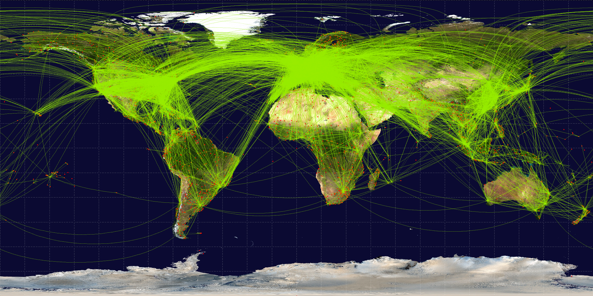

# Setup

## Row 1 {height="30%"}

### Column 1

::: {.card .code-block title="Loading Libraries"}
```{r}
# Read large parquet files efficiently
library("arrow")
# Convert between country codes and standardized country names
library("countrycode")
# Provide world map data
library("maps")
# Convert ggplot outputs into interactive plots
library("plotly")
# Format numbers (commas, percent labels) for axes and legends
library("scales")
# Render interactive tables
library("DT")
# Load core tidyverse packages (dplyr, ggplot2, tidyr, stringr, etc.)
library("tidyverse")
```
:::

### Column 2

::: {.card .code-block title="Loading data sets"}
```{r}
# Load flight schedule data and airport data

flight_df <- read_parquet("../data/2025_Q4.parquet")
airports_df <- read.csv("../data/airports.csv")

flihgt_rows <- nrow(flight_df)
airports_rows <- nrow(airports_df)
```
:::

## Row 2 {height="70%"}

::: {.card .code-block title="Data wragling"}
```{r}
# Clear out the flights without "Airline"
flight_df <-
  flight_df |>
  filter(Airline != "-")

# Pick out the ICAO code for later joining (first code in list)
flight_df <-
  flight_df |>
  mutate(
    origin_code_first = Track_Origin_ApplicableAirports |>
      str_replace_all("\\[|\\]|'|\\s", "") |>
      str_replace("^-$", NA_character_) |>
      str_extract("^[^,]+"),
    dest_code_first = Track_Destination_ApplicableAirports |>
      str_replace_all("\\[|\\]|'|\\s", "") |>
      str_replace("^-$", NA_character_) |>
      str_extract("^[^,]+")
  ) |>
  select(
    origin_code_first, dest_code_first,
    Callsign, Airline,
    Track_Origin_DateTime_UTC, Track_Destination_DateTime_UTC
  )

# Airports: keep medium/large + valid ICAO + valid lat/lng
airports_df <-
  airports_df |>
  filter(icao_code != "") |>
  filter(type %in% c("large_airport", "medium_airport")) |>
  filter(!is.na(latitude_deg), !is.na(longitude_deg)) |>
  select(
    icao_code,
    name,
    continent,
    iso_country,
    latitude_deg,
    longitude_deg
  )

# Data Join (flight + airport)
flights_airports_df <-
  flight_df |>
  inner_join(
    airports_df |>
      rename(
        origin_airport = name,
        origin_continent = continent,
        origin_country = iso_country,
        origin_latitude = latitude_deg,
        origin_longitude = longitude_deg
      ),
    join_by(origin_code_first == icao_code)
  ) |>
  inner_join(
    airports_df |>
      rename(
        dest_airport = name,
        dest_continent = continent,
        dest_country = iso_country,
        dest_latitude = latitude_deg,
        dest_longitude = longitude_deg
      ),
    join_by(dest_code_first == icao_code)
  )

# International flight (exclude domestic ones)
international_flights_df <-
  flights_airports_df |>
  filter(origin_country != dest_country)
```
:::

# Introduction

::: card

# Project Overview

This project aims to reveal the spatial distribution logic of the global aviation network in the post-pandemic era by integrating flight tracking dynamics and global airport infrastructure data from the fourth quarter of 2025. The aviation industry is not only the lifeblood of global trade and tourism but also a crucial indicator of regional economic vitality. According to a report by IATA ([International Air Transport Association](https://www.iata.org/en/pressroom/2026-releases/2026-03-02-02/)), the growth of global air connectivity is exhibiting significant geographical imbalances, which directly impact the efficiency of global supply chains and the resilience of regional economies. By quantifying these patterns, we can identify vulnerable nodes in the global transportation network and provide civil aviation policymakers with insights into hub dependence risks.

Figure 1 provides a historical reference point for the structure of the global airline network before the pandemic, helping frame the broader spatial patterns discussed in this project.

{fig-alt="A world airline route map showing major global aviation connections in 2009."}

*Figure 1. Historical world airline route map (2009). Jpatokal, CC BY-SA 3.0 <https://creativecommons.org/licenses/by-sa/3.0>, via Wikimedia Commons.*

## Research questions

**1) Global Flight Concentration:** What will be the concentration of global air traffic at the end of 2025? Which countries occupy core positions on global routes, and what geographical centralization and sparsity characteristics does this distribution reveal about global air connectivity?

**2) Airport Siphoning by Country:** To what extent do a few major hub airports within a specific country "siphon" traffic from the entire country? By comparison, which countries rely on a single hub (single-core structure), and which exhibit a more balanced multi-hub network?

**3) U.S. Domestic vs. International Flights:** What are the differences in the total number and geographical distribution of domestic and international flights in the United States? Which airports are engines of domestic flow, and which are gateways to the world?

To answer these questions, we utilized two key public datasets:

First, the flight schedule dataset provided by [MrAirspace](https://github.com/MrAirspace/aircraft-flight-schedules), which captures takeoff and landing heading movements based on ADS-B signals; Second, the [OurAirports](https://ourairports.com/help/data-dictionary.html) global airport database, used for geolocation and country-level aggregation of flights. This combination of "dynamic flow" and "static points" allows us to move beyond single flight records and construct a complete global aviation geographic picture.

**Ethical Considerations and Limitations:** In the analysis process, we must be aware of the limitations of the data. Given that raw flight data relies heavily on the coverage of ground-based ADS-B receivers, flight records in low-income or remote regions may be underestimated; consequently, the analytical results may be somewhat skewed toward regions with well-developed infrastructure, such as North America and Europe. Furthermore, this study is based exclusively on publicly available commercial data and does not involve privacy-sensitive records of military or VIP government flights, thereby ensuring the research's compliance and non-intrusive nature.

## Data Context

### Dataset 1: Aircraft Flight Schedules

**Source:** <https://github.com/MrAirspace/aircraft-flight-schedules>

**Access and Publicity:** This dataset is hosted on GitHub and maintained by MrAirspace, making it publicly available scientific research data.

**Creators:** The dataset was compiled and maintained by GitHub contributor MrAirspace. Its core raw signals originate from a globally distributed network of ADS-B (Automatic Dependent Surveillance-Broadcast) receivers.

**Sample Description:** This sample captures global civil aviation flight activity in the fourth quarter of 2025. It records the callsign, airline, and ICAO codes of the scheduled departure and arrival airports for each aircraft. Through cross-validation with databases such as vradarserver, this sample not only includes the physical movement of aircraft but also correlates with commercial operational information. This allows us to track the operational patterns of specific airlines on specific routes.

**Measurement Objects and Methods:** The recorded objects are aircraft entities in operation. The measurement method is through the ADS-B system, where aircraft continuously broadcast their GPS position, altitude, speed, and unique identifier to the ground during flight. These broadcast signals are captured in real time by ground stations and aggregated into structured time-series data.

**Record Size:** In this study, the cleaned original flight schedule for Q4 2025 contains approximately `r flihgt_rows` unique flight records.

**Temporal** **and Geographic Context:** The data covers October to December 2025 (Q4). Theoretically, the geographical scope covers the entire globe, but due to limitations in the density of ground receiving stations, records for North America, Europe, and East Asia are the most detailed.

**Sample Evaluation:**

Advantages: This sample reflects real air traffic flow, rather than just paper schedules, and captures the actual fluctuations caused by temporary delays or route adjustments.

Disadvantages: Due to its reliance on physical receivers, signal coverage has significant blind spots in underdeveloped regions such as the high seas and sub-Saharan Africa, which may lead to severe undersampling bias in the analysis results in these areas.

### Dataset 2: OurAirports Global Airport Database (airports.csv)

**Source:** <https://ourairports.com/help/data-dictionary.html>

**Access and Publicity:** This dataset can be downloaded free of charge from the OurAirports website and is a completely open and free aviation geographic database.

**Creator:** This project is operated by OurAirports.com, a community-driven organization comprising aviation enthusiasts, pilots, and Geographic Information Systems (GIS) experts from around the globe.

**Sample Description:** This dataset serves as a static "encyclopedia" of global civil aviation infrastructure. It provides detailed listings for each airport, including its ICAO and IATA codes, official name, precise geographic coordinates (latitude and longitude), and administrative classification. Furthermore, it categorizes airports by type (e.g., major international hubs, regional airports, heliports, etc.). This serves as a precise geographic reference framework for our dynamic flight data.

**Measurement Objects and Methods:** The objects recorded are physical airport facilities located worldwide. The data is primarily derived from Aeronautical Information Publications (AIPs) issued by national governments and is manually updated and verified by community members using the latest satellite imagery and aeronautical charts.

**Record Scale:** The database contains detailed records for `r airports_rows` facilities globally, ensuring comprehensive analytical coverage.

**Temporal and Geographic Context:** The data reflects the status of global aviation infrastructure during the 2024–2025 period, covering virtually all known civil landing sites with the exception of a few restricted military zones.

**Sample Evaluation:**

Advantages: Possesses exceptional geographic completeness and classification accuracy, establishing it as the gold standard for conducting Spatial Connectivity Analysis.

Disadvantages: As the data is maintained via crowdsourcing, updates regarding small, non-commercial airstrips may occasionally lag behind. However, for the "large and medium-sized airports" that constitute the primary focus of this project, the accuracy remains exceptionally high.

## Group Information

Harry Cheng (Informatics, University of Washington; harrist\@uw.edu) is interested in web development and data analysis.

Maggie Zhou (The Information School, University of Washington; meiqiz2\@uw.edu)is interested in AI research, exploring the algorithms behind AI and the thought processes behind AI research.
:::

# Processing data

::: {.card .code-block title="Graph for Global Flight Concentration"}
```{r}
### Build country-level flight totals (departures + arrivals)
inter_flight_by_country_df <-
  international_flights_df |>
  group_by(origin_country) |>
  summarize(departure_counts = n()) |>
  full_join(
    international_flights_df |>
      group_by(dest_country) |>
      summarize(arrival_counts = n()),
    join_by(origin_country == dest_country)
  ) |>
  rename(country_code = origin_country) |>
  complete(country_code, fill = list(departure_counts = 0L, arrival_counts = 0L)) |>
  mutate(
    total_flights = departure_counts + arrival_counts
  )

# Convert country codes to country names so they match the world map labels
inter_flight_by_country_df <-
  inter_flight_by_country_df |>
  mutate(map_country_name = countrycode(country_code, "iso2c", "country.name"))

# Roll small territories into parent countries for cleaner visualization, then re-aggregate
inter_flight_by_country_df <-
  inter_flight_by_country_df |>
  mutate(
    map_country_name = countrycode(country_code, "iso2c", "country.name"),
    map_country_name = if_else(country_code %in% c("HK", "MO"), "China", map_country_name),
    map_country_name = if_else(country_code %in% c("PR", "VI"), "United States", map_country_name),
    map_country_name = if_else(country_code == "TC", "United Kingdom", map_country_name),
    map_country_name = if_else(map_country_name == "U.S. Virgin Islands", "United States", map_country_name),
    map_country_name = if_else(map_country_name == "Gibraltar", "United Kingdom", map_country_name)
  ) |>
  group_by(map_country_name) |>
  summarize(
    departure_counts = sum(departure_counts),
    arrival_counts   = sum(arrival_counts),
    total_flights    = sum(total_flights)
  )

# Load the world map polygons and standardize a few country labels
world_shape <- map_data("world")

world_shape <-
  world_shape |>
  mutate(
    region = if_else(region == "USA", "United States", region),
    region = if_else(region == "UK", "United Kingdom", region)
  )

# Join flight totals onto the map polygons and draw the choropleth
country_shape_flight <-
  world_shape |>
  left_join(inter_flight_by_country_df, join_by(region == map_country_name)) |>
  mutate(
    # Create hover labels for the interactive world map
    hover_country = region,
    hover_total = coalesce(total_flights, 0),
    hover_departures = coalesce(departure_counts, 0),
    hover_arrivals = coalesce(arrival_counts, 0),
    hover_text = paste0(
      "Country: ", hover_country,
      "<br>Total international flights: ", comma(hover_total),
      "<br>Departures: ", comma(hover_departures),
      "<br>Arrivals: ", comma(hover_arrivals)
    )
  )

global_flight_distribution_plot <-
  ggplot(country_shape_flight) +
  geom_polygon(
    aes(
      x = long,
      y = lat,
      group = group,
      fill = total_flights,
      text = hover_text
    )
  ) +
  scale_fill_viridis_c(
    option = "plasma",
    na.value = "grey90",
    name = "Total Flights",
    labels = comma
  ) +
  coord_quickmap() +
  theme_minimal() +
  labs(
    title = "Global Air Connectivity by Country (2025 Q4)",
    subtitle = "Based on international flight counts"
  )


### Sort countries by total flights in descending order and calculate cumulative share
top_n <- 20

top_flight_country_df <-
  inter_flight_by_country_df |>
  filter(!is.na(total_flights)) |>
  arrange(desc(total_flights)) |>
  mutate(
    rank = row_number(),
    share = total_flights / sum(total_flights),
    cumulative_share = cumsum(share)
  ) |>
  head(top_n)

# Total flights (bar)
global_total_bar_plot  <-
  ggplot(
    top_flight_country_df,
    aes(
      x = reorder(map_country_name, -total_flights),
      y = total_flights,
      # Create hover labels for the interactive country ranking chart
      text = paste0(
        "Country: ", map_country_name,
        "<br>Total flights: ", comma(total_flights),
        "<br>Share of total: ", percent(share, accuracy = 0.1)
      )
    )
  ) +
  geom_col(fill = "#440154") +
  scale_y_continuous(labels = comma) +
  theme_minimal() +
  theme(
    axis.text.x = element_text(angle = 45, hjust = 1)
  ) +
  labs(
    title = paste0("Top ", top_n, " Countries by Total Flights"),
    subtitle = "International flight volume (2025 Q4)",
    x = "Country",
    y = "Total Flights"
  )

# Turn the global map into an interactive plot
global_flight_distribution_interactive <- ggplotly(
  global_flight_distribution_plot,
  tooltip = "text"
)

# Turn the top-country bar chart into an interactive plot
global_total_bar_interactive <- ggplotly(
  global_total_bar_plot,
  tooltip = "text"
)

# Cumulative share (line)
global_cum_share_line_plot <-
  ggplot(top_flight_country_df, aes(x = rank, y = cumulative_share)) +
  geom_line(color = "#E6C619", linewidth = 1) +
  geom_point(color = "#E6C619", size = 1.8) +
  scale_y_continuous(labels = percent, limits = c(0, 1)) +
  scale_x_continuous(
    breaks = top_flight_country_df$rank,
    labels = top_flight_country_df$map_country_name,
    expand = expansion(mult = c(0.01, 0.01))
  ) +
  theme_minimal() +
  theme(
    axis.text.x = element_text(angle = 45, hjust = 1)
  ) +
  labs(
    title = paste0("Cumulative Share (Top ", top_n, " Countries)"),
    subtitle = "How quickly global traffic accumulates among top-ranked countries",
    x = "Country (ranked by total flights)",
    y = "Cumulative Share"
  )
```
:::

::: {.card .code-block title="Graph for Hubs"}
```{r}
### Global Hub Dominance

# Arrival data
global_country_airports_arr_count <-
  flights_airports_df |>
  group_by(dest_country, dest_airport) |>
  summarise(arr_total = n())

# Departure data
global_country_airports_dep_count <-
  flights_airports_df |>
  group_by(origin_country, origin_airport) |>
  summarise(dep_total = n())

# Arr + Dep = total
global_country_airports_count <-
  global_country_airports_arr_count |>
  full_join(global_country_airports_dep_count,
            join_by(
              dest_country == origin_country,
              dest_airport == origin_airport
            )) |>
  rename(country_code = dest_country, airport = dest_airport) |>
  mutate(
    arr_total = if_else(is.na(arr_total), 0, arr_total),
    dep_total = if_else(is.na(dep_total), 0, dep_total),
    total = arr_total + dep_total
  )

# Calculate the fight total in each country
# Calculate the share and rank for each airport in its country
global_country_airports_rank <-
  global_country_airports_count |>
  group_by(country_code) |>
  mutate(
    country_total = sum(total),
    airport_share = total / country_total
  ) |>
  arrange(desc(total)) |>
  mutate(rank = row_number())

# We check the share of top 1 and top 1-3 airport for each country
global_country_hub_data <-
  global_country_airports_rank |>
  filter(country_total >= 10000) |>
  group_by(country_code) |>
  summarise(
    top_1_share = airport_share[1],
    top_3_share = sum(airport_share[1:3], na.rm = TRUE),
    flight_total = country_total[1]
  )

# Use the more formal country name
global_country_hub_data <-
  global_country_hub_data |>
  mutate(country_name = countrycode(country_code, "iso2c", "country.name"))

hub_datatable <-
  global_country_hub_data |>
  mutate(
    top_1_share = round(top_1_share * 100,1),
    top_3_share = round(top_3_share * 100,1)
  ) |>
  select(
    country_name,
    flight_total,
    top_1_share,
    top_3_share
  ) |>
  arrange(desc(flight_total))

global_country_hub_top20 <-
  global_country_hub_data |>
  arrange(desc(top_1_share)) |>
  slice(1:20)

# Top 20 Hub
global_top_hub_country_plot <-
  ggplot(global_country_hub_top20, aes(x = reorder(country_name, top_1_share), y = top_1_share)) +
  geom_col(fill = "#2EC4B6") +
  coord_flip() +
  scale_y_continuous(
    labels = percent_format(accuracy = 1),
    limits = c(0, 1),
    expand = expansion(mult = c(0, 0.05))
  ) +
  theme_minimal() +
  theme(panel.grid.minor = element_blank()) +
  labs(
    title = "Hub Dominance: Top 1 Airport Share (Top 20 Country/Region)",
    subtitle = "Must have at least 10,000 flights",
    x = NULL,
    y = "Top 1 airport share"
  )

# This time, pick the top 15 big total flight country
global_top15_country_hub <-
  global_country_hub_data |>
  arrange(desc(flight_total)) |>
  slice(1:15)

global_top_country_hub_plot <-
  ggplot(global_top15_country_hub, aes(x = reorder(country_name, top_3_share), y = top_3_share)) +
  geom_col(fill = "#2EC4B6") +
  coord_flip() +
  scale_y_continuous(
    labels = percent_format(accuracy = 1),
    limits = c(0, 1),
    expand = expansion(mult = c(0, 0.05))
  ) +
  theme_minimal() +
  theme(panel.grid.minor = element_blank()) +
  labs(
    title = "Hub Dominance: Top 3 Airports’ Share",
    subtitle =  "Top 15 by total flights (>= 10,000)",
    x = NULL,
    y = "Top 3 airport share"
  )
```
:::

::: {.card .code-block title="Graph for U.S."}
```{r}
# Statistics on the number of international flights from US to various countries
outbound_df <- flights_airports_df |>
  # The departure point is US, destination is not US
  filter(origin_country == "US", dest_country != "US") |>
  group_by(dest_country, dest_airport, dest_latitude, dest_longitude) |>
  summarise(flight_count = n(), .groups = "drop")

inbound_df <- flights_airports_df |>
  # The departure point is not US, destination is US
  filter(origin_country != "US", dest_country == "US") |>
  # Summarized by country and airport of origin
  group_by(origin_country, origin_airport, origin_latitude, origin_longitude) |>
  summarise(flight_count = n(), .groups = "drop")

# Statistics on the number of flights from US to US
domestic_df  <-
  flights_airports_df |>
  filter(origin_country == "US", dest_country == "US")

domestic_map_df  <- bind_rows(
  domestic_df |>
    transmute(airport = origin_airport, lat = origin_latitude, lon = origin_longitude),
  domestic_df |>
    transmute(airport = dest_airport, lat = dest_latitude, lon = dest_longitude)
) |>
  count(airport, lat, lon, name = "flight_count")

# Total international exchanges(Outbound + Inbound)
intl_summary <- outbound_df |>
  group_by(dest_country) |>
  summarize(out_n = sum(flight_count)) |>
  full_join(
    inbound_df |>
      group_by(origin_country) |>
      summarize(in_n = sum(flight_count)),
    by = c("dest_country" = "origin_country")
  ) |>
  mutate(
    out_n = coalesce(out_n, 0),
    in_n = coalesce(in_n, 0),
    total_intl = out_n + in_n
  ) |>
  rename(country_code = dest_country) |>
  mutate(country_name = countrycode(country_code, "iso2c", "country.name"))

# Top 10 selected
intl_top_countries <- intl_summary |>
  slice_max(total_intl, n = 10) |>
  # Sort by quantity
  mutate(country_name = reorder(country_name, total_intl))

# Match airport coordinates to specific US states
states_map <- map_data("state")

domestic_state_data <- domestic_map_df |>
  mutate(state_name = map.where("state", lon, lat)) |>
  # clean data
  mutate(state_name = gsub(":.*", "", state_name)) |>
  filter(!is.na(state_name)) |>
  group_by(state_name) |>
  summarise(dom_flight_n = sum(flight_count), .groups = "drop")

# US State map Data
usa_state_map_data <- states_map |>
  left_join(domestic_state_data, by = c("region" = "state_name"))
# Chart 1: Top 10 International Flights by Total Round Trip Volume
us_top_inter_plot <-
  ggplot(
    intl_top_countries,
    aes(
      x = country_name,
      y = total_intl,
      fill = total_intl,
      # Create hover labels for the interactive U.S. international chart
      text = paste0(
        "Country: ", as.character(country_name),
        "<br>Total international flights: ", comma(total_intl),
        "<br>Outbound from U.S.: ", comma(out_n),
        "<br>Inbound to U.S.: ", comma(in_n)
      )
    )
  ) +
  geom_col(width = 0.7) +
  scale_fill_gradient(low = "#74add1", high = "#313695", name = "total flights") +
  # Turn the coordinate axes horizontally
  coord_flip() +
  geom_text(aes(label = comma(total_intl)), hjust = -0.1, size = 3.5) +
  scale_y_continuous(labels = comma, expand = expansion(mult = c(0, 0.15))) +
  theme_minimal() +
  labs(
    title = "Top 10 Countries by International Flight Volume to/from U.S.",
    subtitle = "Combined inbound and outbound flight counts",
    x = "Country Name",
    y = "Total Flights"
  ) +
  theme(
    panel.grid.minor = element_blank(),
    plot.title = element_text(face = "bold", size = 14),
    axis.title = element_text(face = "italic")
  )

# Chart 2: Domestic Flight Density Map in the United States
us_top_domes_plot <-
  ggplot(usa_state_map_data) +
  # Domestic flights within the United States
  geom_polygon(
    aes(
      x = long,
      y = lat,
      group = group,
      fill = dom_flight_n,
      # Create hover labels for the interactive U.S. state map
      text = paste0(
        "State: ", str_to_title(region),
        "<br>Domestic flights: ", comma(coalesce(dom_flight_n, 0)),
        "<br>Measure: departures + arrivals aggregated from airport locations"
      )
    ),
    color = "white", linewidth = 0.2
  ) +
  scale_fill_gradient(low = "#F3E5F5", high = "#4A148C",
                      name = "Domestic flights distribution", labels = label_comma(),
                      na.value = "grey90") +
  
  # Settings
  coord_fixed(1.3) +
  theme_minimal() +
  labs(
    title = "Domestic Flight Activity by State in the U.S.",
    subtitle = "Departures + arrivals aggregated from airport locations",
    x = NULL, y = NULL
  ) +
  theme(
    legend.position = "right",
    panel.grid = element_blank(),
    axis.text = element_blank(),
    plot.title = element_text(hjust = 0.5, face = "bold", size = 14),
    plot.subtitle = element_text(hjust = 0.5)
  )

# --- Chart 3: U.S. Domestic vs International Flight Volume (NOT "market") ---
us_domestic_n <- nrow(domestic_df)

us_international_n <- sum(outbound_df$flight_count) + sum(inbound_df$flight_count)

us_dom_vs_int_df <- data.frame(
  flight_type = c("Domestic", "International"),
  flight_count = c(us_domestic_n, us_international_n)
)

us_dom_vs_int_plot <-
  ggplot(us_dom_vs_int_df, aes(x = reorder(flight_type, flight_count), y = flight_count)) +
  geom_col(width = 0.7, fill = "#313695") +
  coord_flip() +
  geom_text(aes(label = comma(flight_count)), hjust = -0.1, size = 3.5) +
  scale_y_continuous(labels = comma, expand = expansion(mult = c(0, 0.15))) +
  theme_minimal() +
  labs(
    title = "U.S. Domestic vs International Flight Volume",
    subtitle = "International = inbound + outbound flights involving the U.S.",
    x = NULL,
    y = "Flight Count"
  ) +
  theme(
    panel.grid.minor = element_blank(),
    plot.title = element_text(face = "bold", size = 14),
    axis.title = element_text(face = "italic")
  )

# Display Interactive Chart
# Turn the U.S. international bar chart into an interactive plot
us_top_inter_interactive <- ggplotly(us_top_inter_plot, tooltip = "text")
# Turn the U.S. domestic state map into an interactive plot
us_top_domes_interactive <- ggplotly(us_top_domes_plot, tooltip = "text")
```
:::

# Global

## Row 1

### Column 1

::: {.card title="Key Takeaways"}
-   Global international flight activity is **highly concentrated**: a small set of countries accounts for a disproportionately large share of total flights.\
-   The concentration is visible both **geographically** (dense clusters in a few regions) and **quantitatively** (the cumulative share rises quickly among top-ranked countries).\
-   Because this section focuses on **international flights only**, domestic aviation patterns are analyzed separately (especially in the U.S. section).\
-   These results describe **connectivity patterns in the dataset** (scheduled/recorded flights), not passenger or cargo volume.
:::

### Column 2

::: {.card .plot}
```{r}
#| fig-alt: "A world choropleth map shading countries by total scheduled flight counts, with darker colors representing more flights."
#| echo: false
global_flight_distribution_interactive
```
:::

## Row 2

### Column 1

::: {.card .plot}
```{r}
#| fig-alt: "A bar chart showing the absolute number of international flights for the top countries, highlighting the leaders in global connectivity."
#| echo: false
global_total_bar_interactive
```
:::

### Column 2

::: {.card .plot}
```{r}
#| fig-alt: "A line graph illustrating the cumulative percentage of global flights, showing how the top countries quickly account for the majority of total traffic."
#| echo: false
global_cum_share_line_plot
```
:::

# Hubs

## Row 1

::: {.card title="Key Takeaways"}
-   Hub dominance varies widely: some countries are strongly **hub-dominated**, where one airport captures most national flight activity, while others distribute traffic across multiple hubs.\
-   **Top 1 share** highlights “single-hub” systems; **Top 3 share** distinguishes multi-hub systems from broadly distributed networks.\
-   Among high-volume countries, some remain highly concentrated (Top 3 share stays high), while others (e.g., large multi-center networks) show much lower concentration.\
-   The table provides exact values for flight totals and concentration metrics (Top 1 / Top 3 shares), enabling quick country-level comparisons.
:::

::: {.card title="Data about the hub dominance"}
```{r}
#| echo: false
hub_datatable |> datatable()
```
:::

## Row 2

::: {.card .plot}
```{r}
#| echo: false
#| fig-alt: "A horizontal bar chart illustrating the traffic share of the leading airport across the top 20 countries/regions; the data shows that in smaller economies or city-states, a single gateway often accounts for nearly 100% of the nation's total aviation traffic."
global_top_hub_country_plot
```
:::

::: {.card .plot}
```{r}
#| echo: false
#| fig-alt: "A horizontal bar chart showing the combined traffic share of the top three airports in major aviation markets; the results contrast high-concentration markets like the UAE and Thailand against the U.S., where traffic is more distributed across numerous major hubs."
global_top_country_hub_plot
```
:::

# U.S.

## Row 1

### Column 1

::: {.card title="Key Takeaways"}
-   U.S. **domestic** flight volume is much larger than **international** flight volume (international = inbound + outbound involving the U.S.).\
-   International connections are concentrated among a small set of partner countries, with **Canada and Mexico** dominating the top ranks.\
-   Domestic flight activity is uneven across states, with higher intensity in major population and hub states (**departures + arrivals aggregated from airport locations**).\
-   This section measures **flight counts/activity** (not passenger demand or cargo trade); some territories may appear separately depending on the country-code definition.
:::

### Column 2

::: {.card .plot}
```{r}
#| echo: false
#| fig-alt: "A horizontal bar chart comparing U.S. domestic and international flight volumes; the data shows that domestic flights significantly outnumber international ones, reflecting a highly inward-facing aviation market."
us_dom_vs_int_plot
```
:::

## Row 2

::: {.card .plot}
```{r}
#| echo: false
#| fig-alt: "A horizontal bar chart listing the top 10 countries by flight volume to and from the U.S.; the chart highlights a heavy concentration of traffic with Canada and Mexico, demonstrating strong regional connectivity within North America."
us_top_inter_interactive
```
:::

::: {.card .plot}
```{r}
#| echo: false
#| fig-alt: "A choropleth map of the United States showing the density of domestic flight activity by state; the map reveals an uneven geographic distribution, with activity heavily concentrated in large hubs like Texas, Florida, and California."
us_top_domes_interactive
```
:::

# Coding Notes

::: {.card title="Coding Notes (Intermediate/novel list)"}
This section list out the tools/method used in our project and explains their role in the analysis.

**Missing Data Handling**\
We handled missing values by cleaning inconsistent entries and replacing them in ways that kept the dataset usable for analysis. This reduced distortion in our summaries and made our comparisons more complete and reliable.\
Methods: `str_replace()`, `coalesce()`, `if_else()`, `complete()`, `sum(na.rm = TRUE)`

**Conditional Transformation**\
We used conditional transformations to recode and standardize values when different labels referred to the same broader category. This made the data more consistent and allowed us to group and compare observations more meaningfully.\
Methods: `if_else()`

**Maps**\
We used map-based visualizations to display geographic patterns in the data and make spatial differences easier to interpret. This helped us communicate location-based trends more clearly than a non-spatial chart would.\
Methods: `map_data()`, `map.where()`, `geom_polygon()`

**Strings**\
We used string-processing tools to clean, extract, and standardize text values before analysis. This made the raw data easier to organize and ensured that similar entries were treated consistently.\
Methods: `str_replace()`, `str_replace_all()`, `str_extract()`, `gsub()`
:::

::: {.card title="Coding Notes (extra tools)"}
This section introduces additional tools that were not part of our core class toolkit but appeared in our project. We briefly explain what each one helped us do in our workflow and note where we learned or encountered it.

**arrow + `read_parquet()`**\
We used `arrow` and `read_parquet()` to load the flight dataset from a Parquet file format. Source: We learned about this through ChatGPT when we identified our first data set but didn't know how to do with `parquet` file (what we usually do in class is csv).

**`rename()`**\
We used `rename()` to make variable names clearer and more consistent after joining or transforming data. This helped us keep track of similar fields and made later steps in the analysis easier to read.\
Source: We learned this through ChatGPT while processing the data. It can make sure that the column name before/after join is reflecting the right concept. Example like a flight will have a origin and a destination, but we can't just name them the same with `airport`. We have to give different name, `origin_airport` and `dest_airport`

**countrycode + `countrycode()`**\
We used `countrycode()` to convert ISO country codes into full country names so the data would be easier to interpret and match with map labels. This made the results more readable and more suitable for visualization.\
Source: We learned this through ChatGPT when we needed a way to translate country codes into more common names. It was especially useful for preparing the data for maps and summaries.

**`cumsum()`**\
We used `cumsum()` to calculate cumulative values across ranked observations. This helped us show how quickly the total share accumulated among the leading categories.\
Source: I learned this through ChatGPT while building the cumulative distribution for global distribution.

**`scale_x_continuous()` and `scale_y_continuous()`**\
We used these functions to control how axes were displayed, including labels, limits, and spacing. This made the plots easier to read and helped present the values in a clearer format.\
Source: We learned this through ChatGPT while adjusting the appearance of our charts. It helped us understand how ggplot2 allows more precise control over axis formatting.

**`count()`**\
We used `count()` as a quick way to summarize how often grouped observations appeared in the data. This simplified parts of the workflow that would otherwise require a separate `group_by()` and `summarize()`.\
Source: We learned this through ChatGPT when looking for a shorter way to aggregate repeated observations. It was introduced as a convenient dplyr shortcut for grouped counting.

**`slice_max()`**\
We used `slice_max()` to select the top observations based on a chosen variable. This made it easier to focus on the highest-volume categories without writing a longer filtering workflow.\
Source: We learned this through ChatGPT while trying to extract the top-ranked results for one of our plots. It was useful because it directly selects the largest values in a clean way.

**`geom_text()`**\
We used `geom_text()` to place numeric labels directly on the charts. This made the visualizations easier to interpret because viewers could see exact values without estimating from the axis alone.\
Source: We learned this through ChatGPT when improving the readability of our plots. It was suggested as a way to add direct annotations to bar charts.

**`reorder()`**\
We used `reorder()` to sort categorical labels based on numeric values rather than alphabetical order. This made the ranking patterns in the charts much easier to understand visually.\
Source: We learned this through ChatGPT while fixing the order of categories in ggplot. It helped us understand how to make bar charts follow the logic of the data instead of default label order.

**`coord_quickmap()`, `coord_fixed()`, and `coord_flip()`**\
We used these coordinate functions to control plot orientation and spatial proportions. Together, they helped us improve map accuracy, preserve visual balance, and make some bar charts more readable.\
Source: We learned these through ChatGPT while adjusting maps and plot layouts. They were introduced as useful ggplot2 tools for handling both geographic displays and chart orientation.
:::

# Conslusion

Our analysis shows that global air connectivity in 2025 Q4 is highly concentrated rather than evenly distributed. International flight activity is led primarily by North America and Europe, with East Asia also playing an important but somewhat secondary role. By contrast, many countries in the Global South appear much less connected in this dataset, especially in Africa, where a large number of observations are missing or unavailable. This means the global pattern is not only concentrated, but also regionally uneven, with strong activity clustered in a relatively small number of countries and regions.

Hub dominance also varies substantially across countries, and the two hub-share plots highlight different kinds of systems. The countries that rank highest in top 1 airport share are almost entirely different from those that rank highest in top 3 airport share, showing that single-hub dominance and multi-hub concentration are not the same pattern. In other words, some countries depend heavily on one dominant gateway, while others distribute large shares of traffic across a small group of major airports. Looking at both measures gives a fuller picture of how national air networks are structured.

The U.S. case reinforces this broader pattern. Domestic flight volume is far larger than international flight volume, showing that the U.S. aviation system is driven primarily by internal connectivity. Its international traffic is also concentrated among a small set of partner countries, especially nearby countries such as Canada and Mexico, while domestic activity is unevenly distributed across states. At the same time, our results should be interpreted as estimates of flight activity rather than total transportation importance, since flight counts do not capture passenger volume, seat capacity, route distance, or cargo movement. Because the dataset only covers one quarter, it may also reflect seasonal patterns. Future work could extend this analysis by using full-year data and adding measures such as passenger counts, aircraft capacity, or route distance to better evaluate global and national air connectivity.


